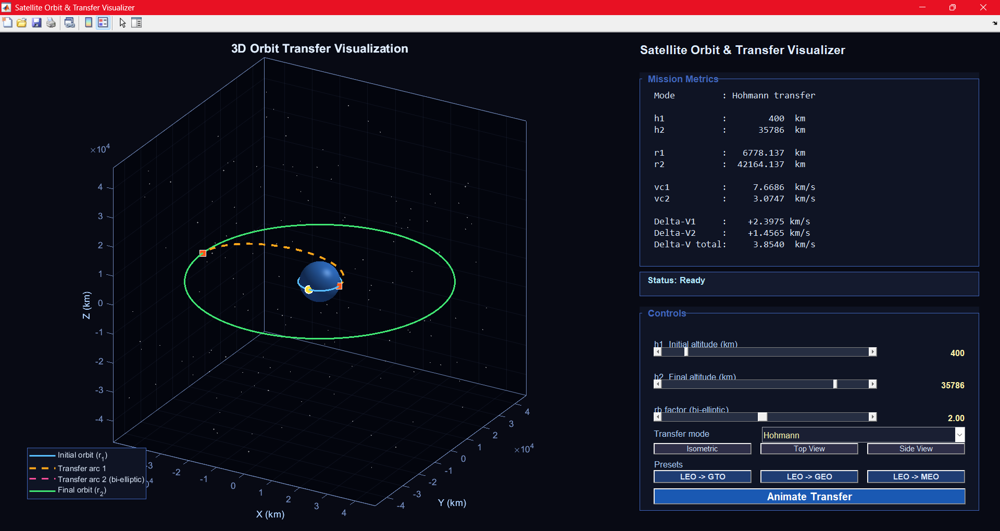

# Satellite Orbit & Transfer Visualiser

A 3D orbital transfer visualiser built in MATLAB. Animates Hohmann 
and bi-elliptic transfers between circular orbits with live delta-V and 
transfer time overlays computed from two-body impulsive burn equations.


## Demo



---

## Features

- 3D textured Earth sphere with starfield background
- Initial orbit, transfer arc, and final orbit drawn in distinct colours
- Satellite marker animated along the full transfer path
- Live metrics overlay: v₁, v₂, ΔV₁, ΔV₂, total ΔV, transfer time, 
  orbital energy
- Hohmann and bi-elliptic transfer modes
- Interactive sliders for h₁ (200–2000 km) and h₂ (up to GEO)
- Bi-elliptic mode shows delta-V saving vs Hohmann equivalent
- Camera presets: isometric, top view, side view
- Three mission presets: LEO to GTO, LEO to GEO, LEO to MEO
- No toolboxes required 

---

## Physics

All calculations use standard two-body Keplerian mechanics with coplanar 
impulsive burns.

**Circular speed**

$$v_c(r) = \sqrt{\frac{\mu}{r}}$$

**Hohmann transfer semi-major axis**

$$a_t = \frac{r_1 + r_2}{2}$$

**Delta-V burns**

$$\Delta V_1 = \sqrt{\mu\left(\frac{2}{r_1} - \frac{1}{a_t}\right)} - v_c(r_1)$$

$$\Delta V_2 = v_c(r_2) - \sqrt{\mu\left(\frac{2}{r_2} - \frac{1}{a_t}\right)}$$

**Transfer time (half-period)**

$$t_t = \pi\sqrt{\frac{a_t^3}{\mu}}$$

**Specific orbital energy**

$$\varepsilon = -\frac{\mu}{2a}$$

**Constants used**

| Symbol | Value | Units |
|--------|-------|-------|
| μ | 398600.4418 | km³/s² |
| Rₑ | 6378.137 | km |

---

## Default parameters

| Parameter | Value |
|-----------|-------|
| Initial altitude h₁ | 400 km (LEO) |
| Final altitude h₂ | 35,786 km (GEO) |
| Transfer mode | Hohmann |

---

## How to run

1. Clone or download this repository
2. Open MATLAB (base installation, no toolboxes needed)
3. Place `SatelliteOrbitVisualizer.m` in your working directory
4. Optionally add `earth_texture.jpg` (equirectangular projection) 
   in the same folder for a textured Earth — falls back to solid blue 
   without it
5. Run:
```matlab
SatelliteOrbitVisualizer
```

---

## Earth texture

The visualiser works without a texture file. If you want the textured 
Earth, download any free equirectangular Earth map (search "earth 
texture map equirectangular") and save it as `earth_texture.jpg` in 
the same folder as the script.

---

## Methodology notes

- Two-body problem only — no J2 perturbations, no atmospheric drag
- Coplanar transfers — all orbits in the equatorial plane (Z = 0)
- Impulsive burns — instantaneous velocity changes at burn points
- Transfer ellipse oriented with periapsis on the +X axis

---

## Author
Rubaiyat Mashrafi  
MEng Aerospace Engineering, University of Sheffield  
(https://www.linkedin.com/in/rubaiyatmashrafi/) (https://sites.google.com/view/rubaiyat-maker-portfolio/projects/orbit-transfer-visualiser)
